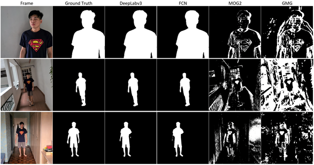
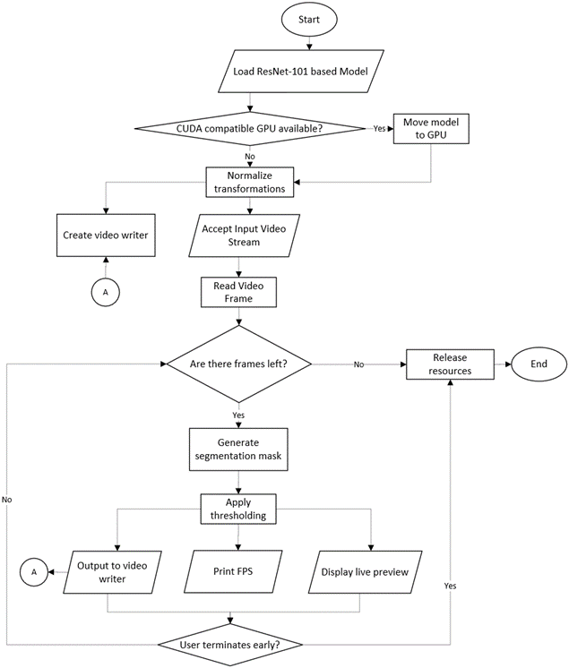
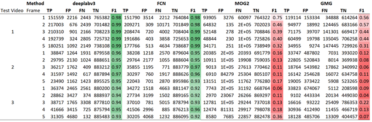
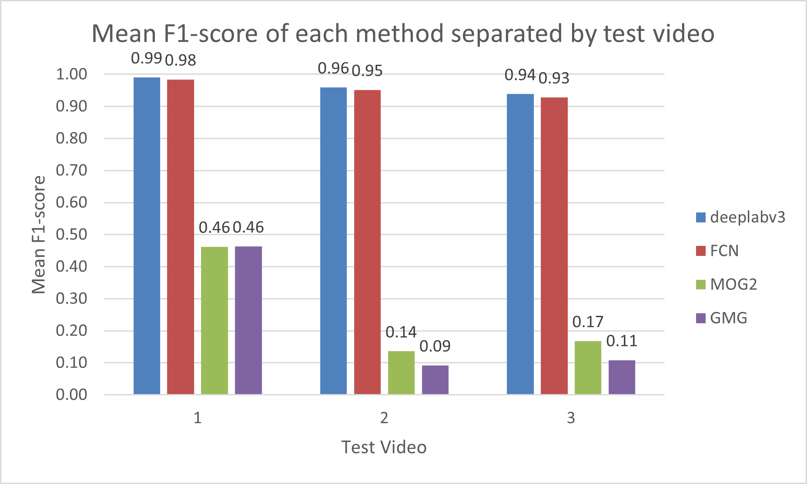
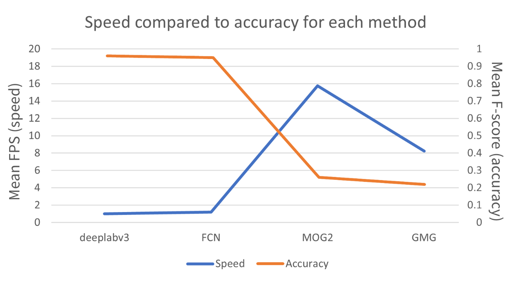

# Introduction

This repository presents a comparison of DeepLabv3, FCN, MOG2 and GMG in extracting human silhouettes from videos. Three videos were recorded: (a) static camera, constant illumination (b) moving camera, constant illumination and (c) static camera, dynamic illumination. The ResNet-101 based models were used to semantically segment human pixels in each frame to create a silhouette binary mask. Binary maps from manual rotoscoping was used as a ground truth to generate a confusion matrix producing the mean F-score of 0.96, 0.95, 0.26 and 0.22 at the mean FPS of 1.00, 1.20, 15.76, and 8.23, respectively. 

# Dataset

A custom test dataset was deemed most suited for this report to compare the tested methods fairly and extensively. The following criterion was created:

*	Only human subject(s). Preferably the same human subject for each video to achieve consistency and fair comparison. Other categories of living or non-living objects are unnecessary for the purpose of this report.
*	Continuous video with no breaks. The video must have a frame rate of 30 which is commonly used in video conferencing applications. The video must contain at least 1 second of footage so that the methods tested may model the background.
*	Binary map ground truth. Each video must have a corresponding binary map to act as the ground truth to perform accuracy calculations. The binary map may be selected frames at a fixed interval to reduce computational complexity as well as manpower needed for manual rotoscoping.
*	Variable difficulty in the form of camera movement, background complexity, illumination changes, etc. The first video should ideally be as simple as possible to act as a best-case scenario. The various difficulties aim to test the limits of each method and find the failure cases.

| Test Video | Camera Movement | Illumination | Background Complexity | Autofocus &amp; Autoexposure | Summary |
| --- | --- | --- | --- | --- | --- |
| **1** | None | Fixed | Simple and uniform | Both locked | First frame is pure background. Subject walks into frame. |
| **2** | Extreme | Fixed | Complex | Both on auto | Stimulates an extreme case of camera shake. Camera follows moving subject. |
| **3** | None | Extreme | Complex | Both on auto | Stimulates an extreme case of lighting changes. Room alternates from being illuminated with natural sunlight from windows and no lighting. |

# Typical Process (Computer Vision Technique)

| Process | Description |
| --- | --- |
| Initialize background | Generate a model of the background based on a predetermined number of frames. |
| Detect foreground | For a given frame, the frame is compared with the background model generated. The comparison can be done via subtraction which would result in extracting the foreground pixels. |
| Maintain background | Based on the learning rate specified, the background model generated in the first process is updated based on the new frames observed. Usually, pixels that have not moved for a long time would be considered as part of the background and hence added to the model. |

# Functions

| Function | Description |
| --- | --- |
| Load video | Program can accept a URL for a video stream or a file reference for a video file. |
| Capture video | Program can capture a live stream typically from a webcam. |
| Remove human silhouette | Extract only the human present in the video. |
| Live preview | Display the silhouette mask generated as well as the silhouette extracted for each frame. |
| FPS counter | Print the FPS of each frame as they are processed. |
| Save processed video | Output processed file. |

# Flowchart

# Results

# References

| No. | Citation |
| --- | --- |
| [1] | J. Foster, The Green Screen Handbook: Real-World Production Techniques, Sybex, 2010. |
| [2] | J. R. J. L. M. C. M. Rudolph C. Baron, &quot;Background replacement for videoconferencing&quot;. United States of America Patent US9503685B2, 25 October 2010. |
| [3] | R. J. Qian and M. I. Sezan, &quot;Video background replacement without a blue screen,&quot; in _International Conference on Image Processing_, Kobe, 1999. |
| [4] | A. Sobral and A. Vacavant, &quot;A comprehensive review of background subtraction algorithms evaluated with synthetic and real videos,&quot; _Computer Vision and Image Understanding,_ vol. 122, pp. 4-21, 2014. |
| [5] | X. Chen, Z. He, D. Anderson, J. Keller and M. Skubic, &quot;Adaptive Silhouette Extraction in Dynamic Environments Using Fuzzy Logic,&quot; in _IEEE International Conference on Fuzzy Systems_, Vancouver, 2006. |
| [6] | M. Piccardi, &quot;Background subtraction techniques: a review,&quot; in _IEEE International Conference on Systems, Man, and Cybernetics_, Sydney, 2004. |
| [7] | Z. Wang, B.-S. Shin and R. Klette, &quot;Accurate Silhouette Extraction of a Person in Video Data by Shadow Evaluation,&quot; _International Journal of Computer Theory and Engineering,_ vol. 6, pp. 476-483, 2014. |
| [8] | A. B. Godbehere, A. Matsukawa and K. Goldberg, &quot;Visual tracking of human visitors under variable-lighting conditions for a responsive audio art installation,&quot; in _American Control Conference (ACC)_, Montreal, 2012. |
| [9] | K. He, X. Zhang, S. Ren and J. Sun, &quot;Deep Residual Learning for Image Recognition,&quot; in _IEEE Conference on Computer Vision and Pattern Recognition_, Las Vegas, 2016. |
| [10] | L.-C. Chen, G. Papandreou, I. Kokkinos, K. Murphy and A. L. Yuille, &quot;DeepLab: Semantic Image Segmentation with Deep Convolutional Nets, Atrous Convolution, and Fully Connected CRFs,&quot; _IEEE Transactions on Pattern Analysis and Machine Intelligence,_ vol. 40, no. 4, pp. 834-848, 2018. |
| [11] | P. KaewTraKulPong and R. Bowden, &quot;An Improved Adaptive Background Mixture Model for Realtime Tracking with Shadow Detection,&quot; _Proceedings of 2nd European Workshop on Advanced Video-Based Surveillance Systems,_ 2002. |
| [12] | O. Tuzel, F. Porikli and P. Meer, &quot;A Bayesian Approach to Background Modeling,&quot; in _IEEE Computer Society Conference on Computer Vision and Pattern Recognition_, San Diego, 2005. |
| [13] | A. Krizhevsky, I. Sutskever and G. Hinton, &quot;ImageNet Classification with Deep Convolutional Neural Networks,&quot; _Neural Information Processing Systems,_ vol. 25, 2012. |
| [14] | M. Babaee, D. T. Dinh and G. Rigoll, &quot;A deep convolutional neural network for video sequence background subtraction,&quot; _Pattern Recognition,_ vol. 76, pp. 635-649, 2018. |
| [15] | E. Shelhamer, J. Long and T. Darrell, &quot;Fully Convolutional Networks for Semantic Segmentation,&quot; _IEEE Transactions on Pattern Analysis and Machine Intelligence,_ vol. 39, 2016. |
| [16] | N. A. Setaiwan, H. Seok-Ju, K. Jang-Woon and L. Chil-Woo, &quot;Gaussian Mixture Model in Improved HLS Color Space for Human Silhouette Extraction,&quot; in _ICAT&#39;06: Proceedings of the 16th international conference on Advances in Artificial Reality and Tele-Existence_, Hangzhou, 2006. |
| [17] | Z. Zivkovic, &quot;Improved Adaptive Gaussian Mixture Model for Background Subtraction,&quot; in _Pattern Recognition_, Cambridge, 2004. |
| [18] | D. Martin, C. Fowlkes, D. Tal and J. Malik, &quot;A Database of Human Segmented Natural Images and its Application to Evaluating Segmentation Algorithms and Measuring Ecological Statistics,&quot; _Proc. 8th Int&#39;l Conf. Computer Vision,_ vol. 2, pp. 416-423, 2001. |
| [19] | V. Shenoy, &quot;Human Segmentation Dataset,&quot; Github, 15 July 2019. [Online]. Available: https://github.com/VikramShenoy97/Human-Segmentation-Dataset. |
| [20] | J. Huang, V. Rathod, C. Sun, M. Zhu, A. Korattikara, A. Fathi, I. Fischer, Z. Wojna, Y. Song, S. Guadarrama and K. Murphy, &quot;Speed/accuracy trade-offs for modern convolutional object detectors,&quot; in _Computer Vision and Pattern Recognition_, Honolulu, 2017. |
