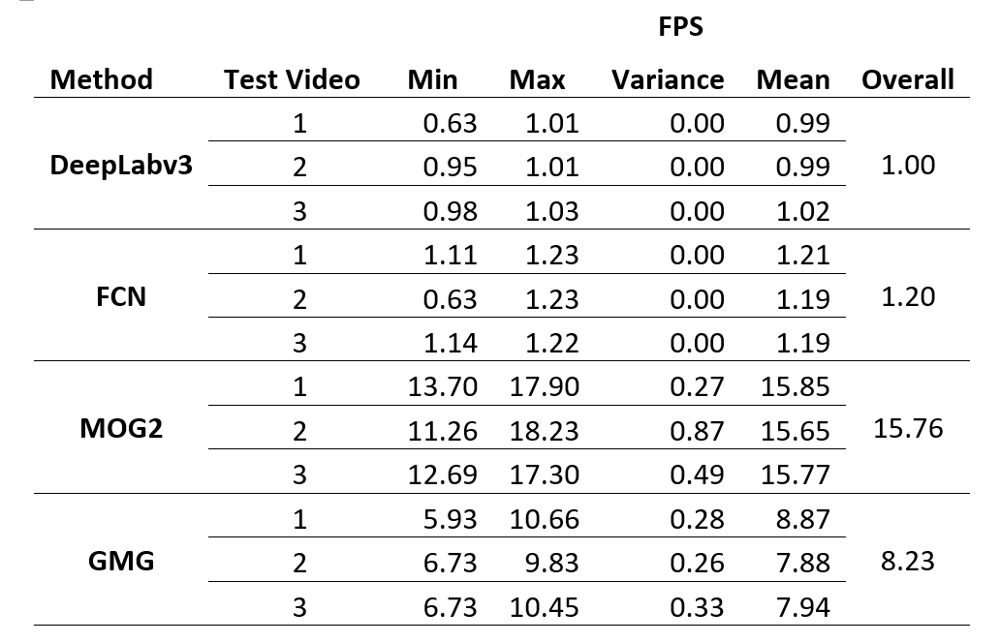

# Human Silhouette Extractor

This repository presents a comparison of DeepLabv3, FCN, MOG2 and GMG in extracting human silhouettes from videos. Three videos were recorded: (a) static camera, constant illumination (b) moving camera, constant illumination and (c) static camera, dynamic illumination. The ResNet-101 based models were used to semantically segment human pixels in each frame to create a silhouette binary mask. Binary maps from manual rotoscoping was used as a ground truth to generate a confusion matrix producing the mean F-score of 0.96, 0.95, 0.26 and 0.22 at the mean FPS of 1.00, 1.20, 15.76, and 8.23, respectively. 

Visually, for test videos 1 and 2, the CNN methods produce nearly perfect segmentation results. They are less accurate for the third video where the limbs of the subject appear to be missing. For all 3 test videos, the computer vision methods deliver poor results where there are holes in the foreground, and the background is wrongly detected as a human silhouette.

## Typical Process

There are many solutions currently available and in-use. It is difficult for a computer vision algorithm to compensate for changes in lighting and camera movement, limiting the use case to static and uniform backgrounds [3]. Due to that, most computer vision techniques are imprecise and do not properly extract all foreground elements [6]. Generally, most algorithms have three main processes to achieve silhouette extraction [4]:

| Process | Description |
| --- | --- |
| Initialize background | Generate a model of the background based on a predetermined number of frames. |
| Detect foreground | For a given frame, the frame is compared with the background model generated. The comparison can be done via subtraction which would result in extracting the foreground pixels. |
| Maintain background | Based on the learning rate specified, the background model generated in the first process is updated based on the new frames observed. Usually, pixels that have not moved for a long time would be considered as part of the background and hence added to the model. |

## Dataset

A custom test dataset was deemed most suited for this report to compare the tested methods fairly and extensively. The following criterion was created:

*	Only human subject(s). Preferably the same human subject for each video to achieve consistency and fair comparison. Other categories of living or non-living objects are unnecessary for the purpose of this report.
*	Continuous video with no breaks. The video must have a frame rate of 30 which is commonly used in video conferencing applications. The video must contain at least 1 second of footage so that the methods tested may model the background.
*	Binary map ground truth. Each video must have a corresponding binary map to act as the ground truth to perform accuracy calculations. The binary map may be selected frames at a fixed interval to reduce computational complexity as well as manpower needed for manual rotoscoping.
*	Variable difficulty in the form of camera movement, background complexity, illumination changes, etc. The first video should ideally be as simple as possible to act as a best-case scenario. The various difficulties aim to test the limits of each method and find the failure cases.

| Test Video | Camera Movement | Illumination | Background Complexity | Autofocus &amp; Autoexposure | Summary |
| --- | --- | --- | --- | --- | --- |
| **1** | None | Fixed | Simple and uniform | Both locked | First frame is pure background. Subject walks into frame. |
| **2** | Extreme | Fixed | Complex | Both on auto | Stimulates an extreme case of camera shake. Camera follows moving subject. |
| **3** | None | Extreme | Complex | Both on auto | Stimulates an extreme case of lighting changes. Room alternates from being illuminated with natural sunlight from windows and no lighting. |

## Flowchart

The .VideoCapture function from OpenCV is used to capture video files from a device or file source. Then, the .read function is used to extract each frame individually. Using the DeepLab pretrained model, a mask is created of the human pixels present in the frame. Next, a bitwise operation is applied to the frame by multiplying the source with the generated mask. The resulting frame is then displayed to the user via the .imshow function. 

## Functions

| Function | Description |
| --- | --- |
| Load video | Program can accept a URL for a video stream or a file reference for a video file. |
| Capture video | Program can capture a live stream typically from a webcam. |
| Remove human silhouette | Extract only the human present in the video. |
| Live preview | Display the silhouette mask generated as well as the silhouette extracted for each frame. |
| FPS counter | Print the FPS of each frame as they are processed. |
| Save processed video | Output processed file. |

## Results

To determine the accuracy of each method, a confusion matrix is calculated as seen in Table 4.1. For each frame, the binary map of the output is compared to the ground truth. The silhouette pixels are pure white (255 intensity value), while the background pixels are pure black (0 intensity value). When a pixel is part of the silhouette in the ground truth, and the output pixel corresponds in location and value, this is marked as one true positive pixel. When the output pixel is determined to be part of the silhouette when it is actually the background, this is marked as one false positive pixel. When the ground truth pixel is a silhouette, but the output pixel fails to identify as such, the pixel is marked as a false negative. When the pixel is a background pixel in both the ground truth and output, this is marked as a true negative.

DeepLab3 leads with the highest overall F1-score of 0.96 across all three test videos. It produces a near-perfect silhouette extraction of 0.99 for the first test video, a slightly reduced score of 0.96 for the second test video and struggles slightly with the third test video at 0.94. As FCN is DeepLabv3’s predecessor, it was expected to perform marginally worse. However, its performance is just slightly DeepLabv3’s.

FCN’s results are 0.1 less accurate across all categories. MOG2 and GMG perform the same for the first test video, at an F-score of 0.46. Both perform the worst in the second test video as the background was constantly moving which cannot be handled by the background modelling technique they both share. At 0.14 and 0.09 F-scores respectively, the result is extremely poor. They perform slightly better with the third test video at 0.17, and 0.11 respectively, as the background is now constant with the camera mounted to a tripod. The computer vision techniques are far inferior compared to the ResNet-101 convolutional networks, performing 4x worse overall.

FPS is chosen over inference time or time per frame as the speed metric because for FPS is more common for video applications and can act as a metric to determine real-time processing speed. The mean FPS of each method is recorded on a per-frame basis. In Table 4.3, the FPS of every frame processed is recorded individually to analyse for a per-frame variance in performance. All three methods have the approximate first frame FPS of 6.23E-10. The FPS of the first frame is excluded as it is significantly longer due to the overhead of initialization. Much of this time is taken by OpenCV to capture a video file and load it as a stream. The time taken to load the CNN models are excluded from the FPS calculation.

The variance of both CNN methods is very low, averaging at 0.0009 FPS. The variance of both computer vision methods are significantly higher compared to the CNN methods, at 0.4158 FPS. This is because ResNet-101 performs identical processing on each input frame regardless of the content, where convolution and deconvolution is applied uniformly which results in near identical processing times. For the computer vison methods however, processing is done with a background modelling approach. Depending on the nature of the background, processing time varies significantly.

The speed results are the opposite of the accuracy results. DeepLabv3 performs the worst among the bunch, at the average of 1.00 FPS. FCN performs 20% better than DeepLabv3, at 1.20 FPS. This is because DeepLab introduced atrous convolution which is not present in the FCN model which carries a performance overhead. MOG2 and GMG are significantly faster at 15.76 and 8.23 FPS, respectively.

When comparing speed and accuracy, computer vision methods have a major advantage in terms of speed, while CNN methods triumph in accuracy. Among the 4 methods discussed, there does not seem to be a middle ground compromise where both speed and accuracy is balanced. The methods only excel in one metric or the other. Between DeepLabv3 and FCN however, FCN is 20% faster with only a 1% accuracy penalty. FCN is the preferred option in this scenario when using a CNN based approach. For the statistical background modelling approaches, MOG2 is superior to GMG as it is 91% faster and 18% more accurate.

## Conclusion

Convolutional neural networks are an abundant class of models that tackle numerous pixelwise tasks. CNNs excel in semantic segmentation in images which can be adapted to extract human silhouettes from videos. The proposed ResNet-101 based solutions using DeepLabv3 and FCN demonstrate accurate results with the overall F-score of 0.96 albeit with a significant performance penalty, running at 1.00 and 1.20 FPS compared to 15.76 and 8.23 FPS of MOG2 and GMG, respectively. A trade-off method that performs well in terms of both accuracy and speed could be found to act as a middle ground to be used in real time applications. A newer CNN based approach such as Faster R-CNN or Context Encoding Network (EncNet) could be explored to address the current limitations.

## References

| No. | Citation |
| --- | --- |
| [1] | J. Foster, The Green Screen Handbook: Real-World Production Techniques, Sybex, 2010. |
| [2] | J. R. J. L. M. C. M. Rudolph C. Baron, &quot;Background replacement for videoconferencing&quot;. United States of America Patent US9503685B2, 25 October 2010. |
| [3] | R. J. Qian and M. I. Sezan, &quot;Video background replacement without a blue screen,&quot; in _International Conference on Image Processing_, Kobe, 1999. |
| [4] | A. Sobral and A. Vacavant, &quot;A comprehensive review of background subtraction algorithms evaluated with synthetic and real videos,&quot; _Computer Vision and Image Understanding,_ vol. 122, pp. 4-21, 2014. |
| [5] | X. Chen, Z. He, D. Anderson, J. Keller and M. Skubic, &quot;Adaptive Silhouette Extraction in Dynamic Environments Using Fuzzy Logic,&quot; in _IEEE International Conference on Fuzzy Systems_, Vancouver, 2006. |
| [6] | M. Piccardi, &quot;Background subtraction techniques: a review,&quot; in _IEEE International Conference on Systems, Man, and Cybernetics_, Sydney, 2004. |
| [7] | Z. Wang, B.-S. Shin and R. Klette, &quot;Accurate Silhouette Extraction of a Person in Video Data by Shadow Evaluation,&quot; _International Journal of Computer Theory and Engineering,_ vol. 6, pp. 476-483, 2014. |
| [8] | A. B. Godbehere, A. Matsukawa and K. Goldberg, &quot;Visual tracking of human visitors under variable-lighting conditions for a responsive audio art installation,&quot; in _American Control Conference (ACC)_, Montreal, 2012. |
| [9] | K. He, X. Zhang, S. Ren and J. Sun, &quot;Deep Residual Learning for Image Recognition,&quot; in _IEEE Conference on Computer Vision and Pattern Recognition_, Las Vegas, 2016. |
| [10] | L.-C. Chen, G. Papandreou, I. Kokkinos, K. Murphy and A. L. Yuille, &quot;DeepLab: Semantic Image Segmentation with Deep Convolutional Nets, Atrous Convolution, and Fully Connected CRFs,&quot; _IEEE Transactions on Pattern Analysis and Machine Intelligence,_ vol. 40, no. 4, pp. 834-848, 2018. |
| [11] | P. KaewTraKulPong and R. Bowden, &quot;An Improved Adaptive Background Mixture Model for Realtime Tracking with Shadow Detection,&quot; _Proceedings of 2nd European Workshop on Advanced Video-Based Surveillance Systems,_ 2002. |
| [12] | O. Tuzel, F. Porikli and P. Meer, &quot;A Bayesian Approach to Background Modeling,&quot; in _IEEE Computer Society Conference on Computer Vision and Pattern Recognition_, San Diego, 2005. |
| [13] | A. Krizhevsky, I. Sutskever and G. Hinton, &quot;ImageNet Classification with Deep Convolutional Neural Networks,&quot; _Neural Information Processing Systems,_ vol. 25, 2012. |
| [14] | M. Babaee, D. T. Dinh and G. Rigoll, &quot;A deep convolutional neural network for video sequence background subtraction,&quot; _Pattern Recognition,_ vol. 76, pp. 635-649, 2018. |
| [15] | E. Shelhamer, J. Long and T. Darrell, &quot;Fully Convolutional Networks for Semantic Segmentation,&quot; _IEEE Transactions on Pattern Analysis and Machine Intelligence,_ vol. 39, 2016. |
| [16] | N. A. Setaiwan, H. Seok-Ju, K. Jang-Woon and L. Chil-Woo, &quot;Gaussian Mixture Model in Improved HLS Color Space for Human Silhouette Extraction,&quot; in _ICAT&#39;06: Proceedings of the 16th international conference on Advances in Artificial Reality and Tele-Existence_, Hangzhou, 2006. |
| [17] | Z. Zivkovic, &quot;Improved Adaptive Gaussian Mixture Model for Background Subtraction,&quot; in _Pattern Recognition_, Cambridge, 2004. |
| [18] | D. Martin, C. Fowlkes, D. Tal and J. Malik, &quot;A Database of Human Segmented Natural Images and its Application to Evaluating Segmentation Algorithms and Measuring Ecological Statistics,&quot; _Proc. 8th Int&#39;l Conf. Computer Vision,_ vol. 2, pp. 416-423, 2001. |
| [19] | V. Shenoy, &quot;Human Segmentation Dataset,&quot; Github, 15 July 2019. [Online]. Available: https://github.com/VikramShenoy97/Human-Segmentation-Dataset. |
| [20] | J. Huang, V. Rathod, C. Sun, M. Zhu, A. Korattikara, A. Fathi, I. Fischer, Z. Wojna, Y. Song, S. Guadarrama and K. Murphy, &quot;Speed/accuracy trade-offs for modern convolutional object detectors,&quot; in _Computer Vision and Pattern Recognition_, Honolulu, 2017. |
